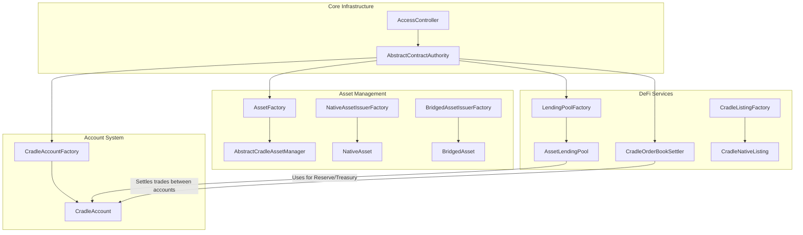
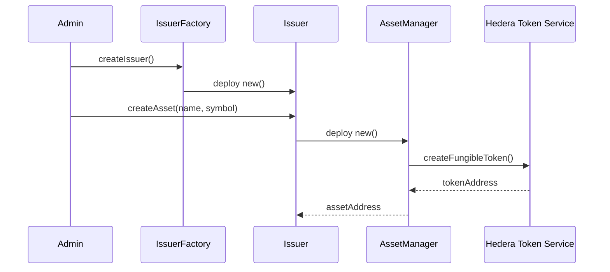
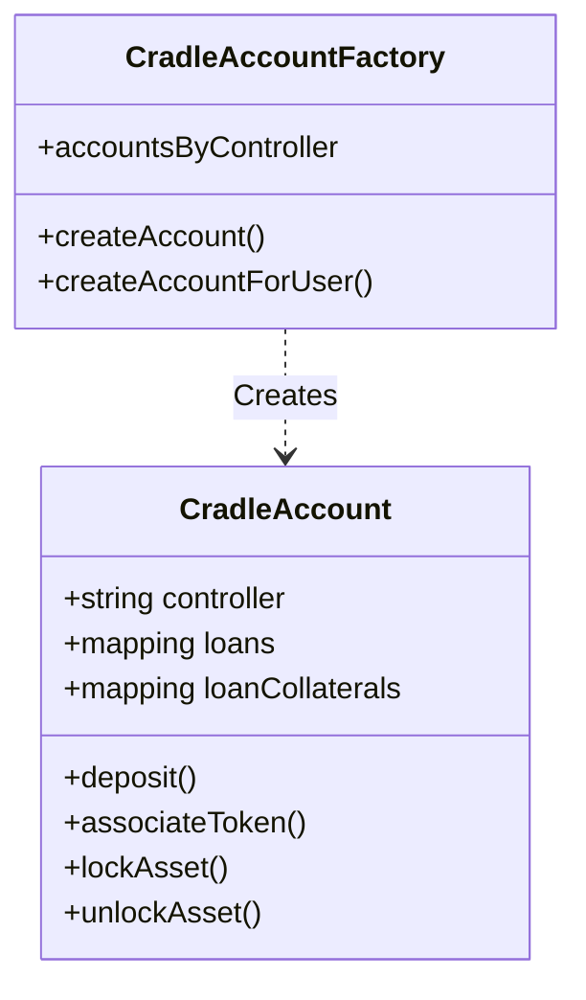
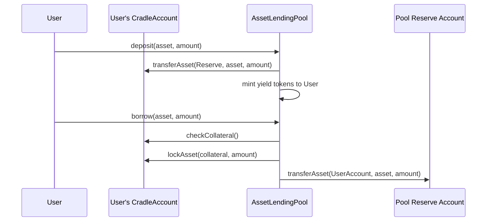
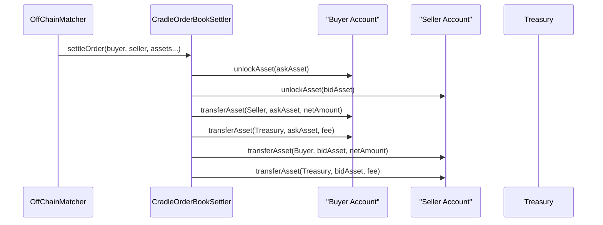

# Cradle Protocol Architecture

The Cradle Protocol is a comprehensive suite of smart contracts on the Hedera network designed to facilitate asset issuance, management, lending, and trading. The architecture is modular, centering around a robust access control system and specialized factories for scalability.

## High-Level Architecture

The system is composed of several key subsystems:
1.  **Core Infrastructure**: Access control and base authorities.
2.  **Asset Management**: Issuance and management of HTS tokens (Native and Bridged).
3.  **Account System**: Smart accounts (`CradleAccount`) for holding assets and managing user interactions.
4.  **DeFi Primitives**: Lending pools and Orderbook settlement.

## Component Interactions

### 1. Asset Issuance & Management
Assets in Cradle are wrappers or managers around Hedera Token Service (HTS) tokens.
- **Issuers**: `NativeAssetIssuer` and `BridgedAssetIssuer` handle the logic for creating new assets.
- **Managers**: `NativeAsset` and `BridgedAsset` (inheriting `AbstractCradleAssetManager`) hold the HTS keys and manage supply (mint/burn).

### 2. Cradle Accounts
`CradleAccount` serves as the primary identity and vault for users and protocols.
- It holds balances.
- It manages collateral for lending.
- It executes transfers for trading.

### 3. Lending & Borrowing
The lending system uses `AssetLendingPool` to manage liquidity.
- **Deposit**: Users deposit assets into the pool's reserve `CradleAccount`.
- **Borrow**: Users borrow against collateral held in their own `CradleAccount` (which gets locked).

### 4. Orderbook Settlement
`CradleOrderBookSettler` allows for atomic settlement of trades matched off-chain.
- It moves funds between the Buyer's and Seller's `CradleAccount`s.
- It collects fees.

