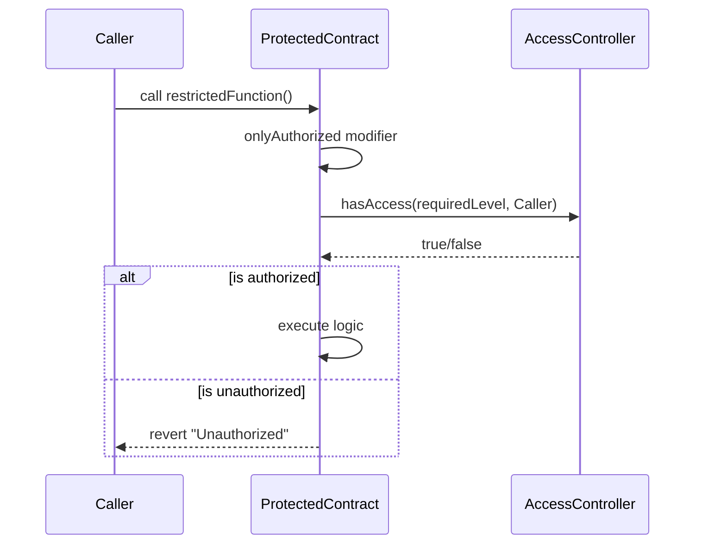
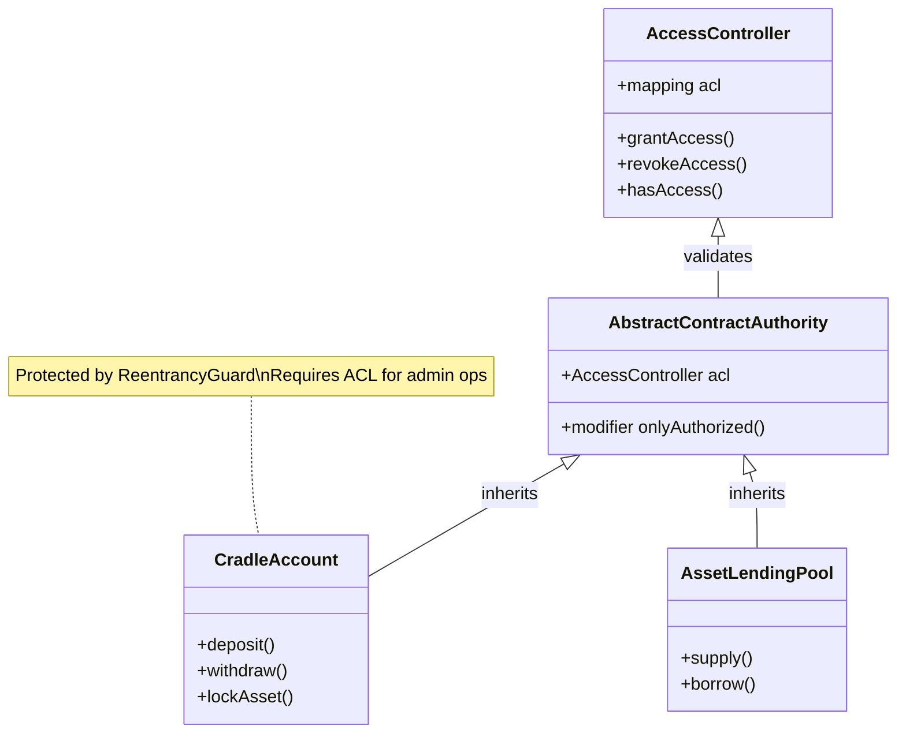

# Cradle Protocol Security Model

The Cradle Protocol employs a multi-layered security model designed to ensure robust access control, safe asset management, and protection against common smart contract vulnerabilities. This document outlines the core security components and strategies.

## 1. Hierarchical Access Control (RBAC)

The core of the security architecture is the `AccessController` contract, which implements a Role-Based Access Control (RBAC) system.

### Key Components
- **AccessController**: Stores and manages permissions. It uses numeric levels (`uint64`) to define roles.
- **AbstractContractAuthority**: An abstract base contract inherited by most system contracts. It queries the `AccessController` to authorize function calls.

### Access Levels
- **Level 0 (Super Admin)**: Full control. Can grant/revoke access to other levels.
- **Level 1 (System/Contract Level)**: Typically assigned to other contracts within the protocol (e.g., `CradleOrderBookSettler`, `AssetFactory`) to allow them to call restricted functions on other system contracts.
- **Level 2 (Oracle/Operational)**: Used for operational tasks like updating price feeds (`AbstractAssetPriceOracle`).
- **Level 3-6**: Reserved for future granular roles.

### Authorization Flow

## 2. Hedera Token Service (HTS) Integration

The protocol leverages the Hedera Token Service for asset management, which provides native security features at the network layer.

- **Key Management**: `AbstractCradleAssetManager` assigns all HTS keys (Admin, KYC, Freeze, Wipe, Supply, Fee, Pause) to the contract address itself. This ensures that no external EOA has direct control over the token supply or properties; only the contract logic (governed by ACL) can trigger these actions.
- **Atomic Operations**: Operations like `mint`, `burn`, and `wipe` are performed via precompiled system contracts (`0x167`), ensuring atomicity and adherence to Hedera's consensus.

## 3. Smart Contract Security Patterns

### Reentrancy Protection
The protocol utilizes `ReentrancyGuard` from OpenZeppelin to prevent reentrancy attacks in critical contracts that handle funds or state changes.
- **Protected Contracts**: `CradleAccount`, `AssetLendingPool`, `CradleNativeListing`.

### Checks-Effects-Interactions
Contracts are designed to follow the Checks-Effects-Interactions pattern where possible, updating state before making external calls (especially relevant for HTS calls and value transfers).

### Factory Pattern
The use of factories (`AssetFactory`, `CradleAccountFactory`, `LendingPoolFactory`) ensures that new instances of contracts are deployed with correct initial configurations and correctly linked to the central `AccessController`.

## 4. Account Isolation

`CradleAccount` acts as a smart wallet or vault.
- **Isolation**: Each user or logical entity has a distinct `CradleAccount`.
- **Approvals**: The account must explicitly approve token transfers via HTS, preventing unauthorized draining of funds.
- **Locking Mechanism**: Supports asset locking (`lockedAssets` mapping) to prevent withdrawal of collateralized or reserved assets.

## 5. Security Diagram

